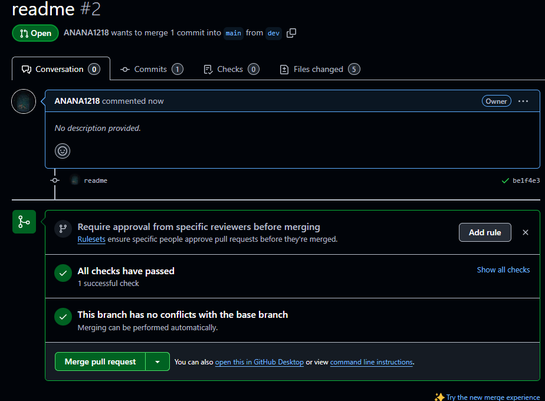

# README: Workflow GitHub Actions avec `act` et Dépannage Git et Python

## Introduction

Dans ce projet, j'ai configuré et utilisé l'outil `act` pour exécuter des workflows GitHub Actions localement. Ce README explique comment j'ai effectué les étapes de gestion de Git et de l'installation de `act`, ainsi que les problèmes que j'ai rencontrés et les solutions apportées.

---

## 1 . **Utilisation de Git pour le Workflow**

Voici les étapes que j'ai suivies pour utiliser Git dans ce projet. Toutes les étapes sont illustrées avec des images pour prouver les actions effectuées.

### Étape 1 : **Ajouter les fichiers au staging**

J'ai utilisé la commande suivante pour ajouter tous les fichiers modifiés au staging de Git :

```bash
git add *
```

Voici le résultat de l'exécution de cette commande :


### Étape 2 : **Committer les changements**

Après avoir ajouté les fichiers, j'ai commis les changements avec un message explicite :

```bash
git commit -m "Votre message de commit"
```

Voici une capture d'écran montrant le commit effectué :


### Étape 3 : **Pousser les changements vers le dépôt distant**

Ensuite, j'ai poussé mes changements vers le dépôt distant avec la commande suivante :

```bash
git push
```

Voici ce que j'ai vu après avoir poussé les changements :


### Étape 4 : **Créer une Pull Request**

Une fois mes changements poussés, j'ai créé une Pull Request sur GitHub pour proposer mes modifications. Voici l'interface de la PR sur GitHub :





### Étape 4 : **Créer une Pull Request**

Après avoir effectué mes changements, je me suis assuré que mes workflows fonctionnaient correctement dans la partie Action sur GitHub :


### Problème 2 : **Problème avec `git checkout`**

Lors de l'utilisation de `git checkout`, j'ai eu quelques erreurs de branchement, généralement liées à des fichiers non suivis ou à des conflits dans le dépôt.

#### Solution :

Avant d'effectuer un `git checkout`, j'ai vérifié l'état du dépôt avec la commande :

```bash
git status
```

Cela m'a permis de m'assurer que tous mes fichiers étaient correctement ajoutés ou ignorés avant de basculer de branche.

---

