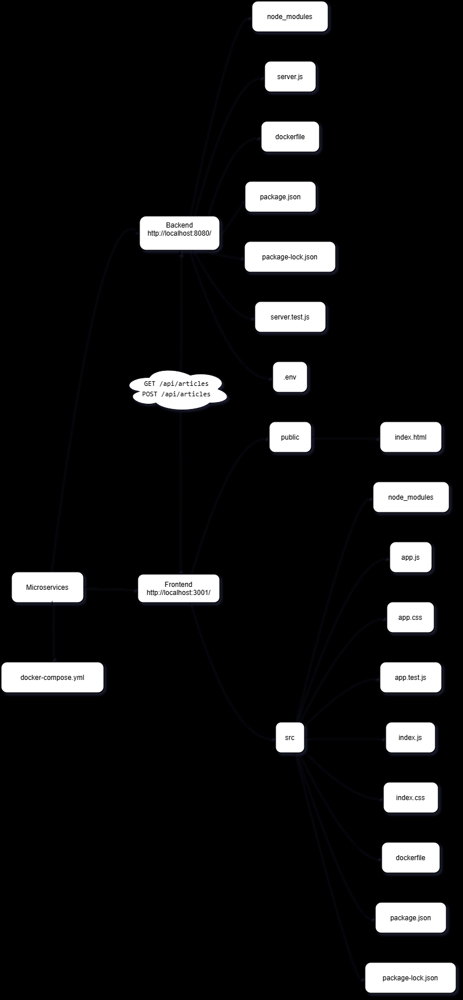
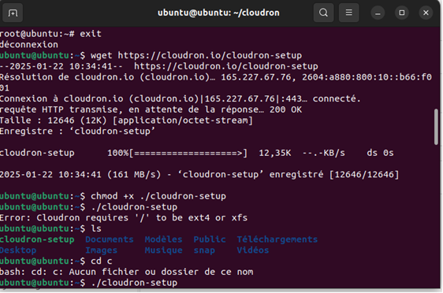

# Projet de Blog avec Microservices et Outils de Monitoring

## Architecture du Projet

Le projet est une application de blog basée sur une architecture de microservices, conteneurisée avec Docker et équipée d'outils de monitoring avancés.

### Composants Principaux

- **Backend** : Application Node.js
- **Frontend** : Application React
- **Base de Données** : MySQL
- **Outils de Monitoring** :
  - cAdvisor
  - Portainer
  - Weave Scope

## Schéma d'Architecture


## Fonctionnalités principales
1. **Backend** :
   - GET `/api/articles` : Récupérer la liste des articles.
   - POST `/api/articles` : Ajouter un nouvel article.
   - Exposé sur le port **8080**.
   
2. **Frontend** :
   - Application React permettant d'afficher et de créer des articles.
   - Exposé sur le port **3001**.

## Configuration Docker Compose

### Étapes de Développement

1. **Configuration Initiale**
   - Création du fichier `docker-compose.yml`
   - Configuration des services de base (backend, frontend, MySQL)

2. **Ajout des Outils de Monitoring**
   - Configuration de cAdvisor
   - Déploiement de Portainer
   - Mise en place de Weave Scope

### Configuration Réseau

```yaml
networks:
  default:
    name: blog-app-network
```

## Outils de Monitoring Détaillés

### 1. Portainer
- **URL** : http://localhost:9000
- **Fonctionnalités** :
  - Gestion des conteneurs
  - Vue d'ensemble de l'infrastructure Docker
  - Monitoring des ressources


### 2. cAdvisor
- **URL** : http://localhost:8081
- **Fonctionnalités** :
  - Collecte de métriques de conteneurs
  - Surveillance des ressources
  - Interface web détaillée


### 3. Weave Scope
- **URL** : http://localhost:4040
- **Fonctionnalités** :
  - Visualisation de l'infrastructure
  - Cartographie dynamique des conteneurs
  - Exploration des relations entre services


### 4. Blog
- **URL** : http://localhost:3001/



### 5. Base de données 
- **URL** : http://localhost:8080/


### 6. Backend avec swagger
- **URL** :http://localhost:5000/api-docs/


## Commandes Utiles

```bash
# Lancer tous les services
docker-compose up -d

# Arrêter les services
docker-compose down

# Voir les logs d'un service
docker-compose logs <nom_du_service>
```

## Problèmes Courants et Solutions

### Weave Scope : Erreurs de Connexion
- Vérifier les permissions
- Ajouter le flag `privileged: true`
- S'assurer que `nf_conntrack` est chargé

### Connectivité Réseau
- Utiliser le réseau `blog-app-network`
- Ajouter des labels Docker pour améliorer la visibilité


### Pour pousser vos images Docker sur Docker Hub (Assurez-vous d'avoir créé un compte Docker Hub au préalable si ce n'est pas déjà fait) :

1. Connectez-vous à Docker Hub :
```bash
docker login
```

2. Taguez vos images locales avec votre nom d'utilisateur Docker Hub :
```bash
docker tag votrenomdutilisateur:latest nana1212/votrenomdutilisateur:latest
docker tag votrenomdutilisateur:latest nana1212/votrenomdutilisateur:latest

```


3. Poussez les images :
```bash
docker push votrenomdutilisateur/backend:latest
docker push votrenomdutilisateur/frontend:latest
```


Remplacez "votrenomdutilisateur" par votre nom d'utilisateur Docker Hub.


graphana :


weave scope


prometheus


portainer 


cAdvisor


Pour lancer les test healcheack il faut faire un bash healthcheck dans un terminal powershell


lancer cypresss:

npm run cypress:run

resultat 

.png>)


## 2 . **Installation de `act`**

### Étapes d'installation

1. **Téléchargement de `act`**
   
   J'ai téléchargé la version Windows de `act` depuis le dépôt GitHub de [nektos/act](https://github.com/nektos/act/releases).
   
2. **Extraction et installation**
   
   J'ai extrait le fichier ZIP et placé le fichier `act.exe` dans un dossier de mon choix sur mon ordinateur.

3. **Ajout de `act` au PATH**

   Pour rendre `act` accessible depuis le terminal, j'ai ajouté son dossier au `PATH` système :
   
   - Ouvrez les **Paramètres système avancés**.
   - Cliquez sur **Variables d'environnement**.
   - Dans la section **Variables système**, sélectionnez la variable `Path` et cliquez sur **Modifier**.
   - Ajoutez le chemin du dossier contenant `act.exe` (par exemple, `C:\Users\VotreNomUtilisateur\act`).
   - Cliquez sur **OK** pour valider.

   Voici à quoi cela ressemble dans les paramètres système :

   

4. **Vérification de l'installation**

   J'ai vérifié l'installation de `act` en tapant la commande suivante dans le terminal :

   ```bash
   act -v
   ```

   Lors de la première exécution, `act` m'a demandé de choisir une image Docker à utiliser pour exécuter les workflows. J'ai eu le choix entre plusieurs options d'images de différentes tailles :

   - **Image de grande taille** : Environ 17 Go, nécessite 75 Go d'espace disque libre.
   - **Image de taille moyenne** : Environ 500 Mo, compatible avec la plupart des actions.
   - **Image de taille micro** : Moins de 200 Mo, contient uniquement NodeJS pour démarrer les actions.

   J'ai choisi l'image de **taille micro** pour sa légèreté.

   

5. **Vérification des workflows avec `act`**

   Après avoir configuré `act`, j'ai exécuté la commande `act -l` pour lister les workflows disponibles.

   Voici le résultat obtenu :

   

---

## 3. **Problèmes rencontrés et solutions**

### Problème 1 : **Erreurs liées à la version de Python**

Lors de l'exécution de `act`, j'ai rencontré des erreurs qui étaient liées à la version de Python installée sur mon système. Cela est souvent dû à une incompatibilité entre les versions de Python et l'environnement d'exécution des actions.

#### Solution :

J'ai vérifié ma version de Python en utilisant la commande :

```bash
python --version
```

Ensuite, j'ai mis à jour Python à la version appropriée.