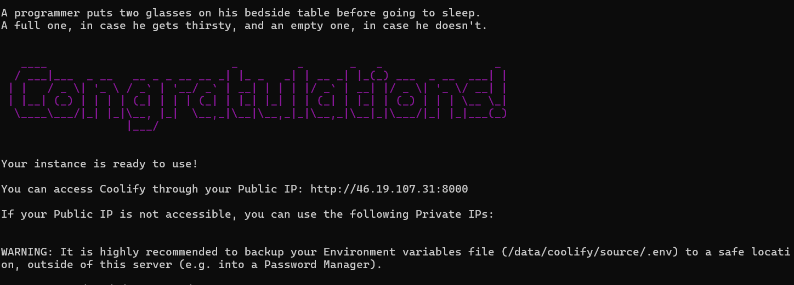

# Projet de Blog avec Microservices et Outils de Monitoring

## Architecture du Projet

Le projet est une application de blog basée sur une architecture de microservices, conteneurisée avec Docker et équipée d'outils de monitoring avancés.

### Composants Principaux

- **Backend** : Application Node.js
- **Frontend** : Application React
- **Base de Données** : MySQL
- **Outils de Monitoring** :
  - cAdvisor
  - Portainer
  - Weave Scope

## Configuration Docker Compose

### Étapes de Développement

1. **Configuration Initiale**
   - Création du fichier `docker-compose.yml`
   - Configuration des services de base (backend, frontend, MySQL)

2. **Ajout des Outils de Monitoring**
   - Configuration de cAdvisor
   - Déploiement de Portainer
   - Mise en place de Weave Scope

### Configuration Réseau

```yaml
networks:
  default:
    name: blog-app-network
```

## Outils de Monitoring Détaillés

### 1. Portainer
- **URL** : http://localhost:9000
- **Fonctionnalités** :
  - Gestion des conteneurs
  - Vue d'ensemble de l'infrastructure Docker
  - Monitoring des ressources


### 2. cAdvisor
- **URL** : http://localhost:8081
- **Fonctionnalités** :
  - Collecte de métriques de conteneurs
  - Surveillance des ressources
  - Interface web détaillée



### 3. Weave Scope
- **URL** : http://localhost:4040
- **Fonctionnalités** :
  - Visualisation de l'infrastructure
  - Cartographie dynamique des conteneurs
  - Exploration des relations entre services


### 4. Blog
- **URL** : http://localhost:3001/


### 5. Base de données 
- **URL** : http://localhost:8080/


## Commandes Utiles

```bash
# Lancer tous les services
docker-compose up -d

# Arrêter les services
docker-compose down

# Voir les logs d'un service
docker-compose logs <nom_du_service>
```

## Problèmes Courants et Solutions

### Weave Scope : Erreurs de Connexion
- Vérifier les permissions
- Ajouter le flag `privileged: true`
- S'assurer que `nf_conntrack` est chargé

### Connectivité Réseau
- Utiliser le réseau `blog-app-network`
- Ajouter des labels Docker pour améliorer la visibilité


### Pour pousser vos images Docker sur Docker Hub (Assurez-vous d'avoir créé un compte Docker Hub au préalable si ce n'est pas déjà fait) :

1. Connectez-vous à Docker Hub :
```bash
docker login
```

2. Taguez vos images locales avec votre nom d'utilisateur Docker Hub :
```bash
docker tag votrenomdutilisateur:latest nana1212/votrenomdutilisateur:latest
docker tag votrenomdutilisateur:latest nana1212/votrenomdutilisateur:latest

```


3. Poussez les images :
```bash
docker push votrenomdutilisateur/backend:latest
docker push votrenomdutilisateur/frontend:latest
```


Remplacez "votrenomdutilisateur" par votre nom d'utilisateur Docker Hub.

### Architecture :


###