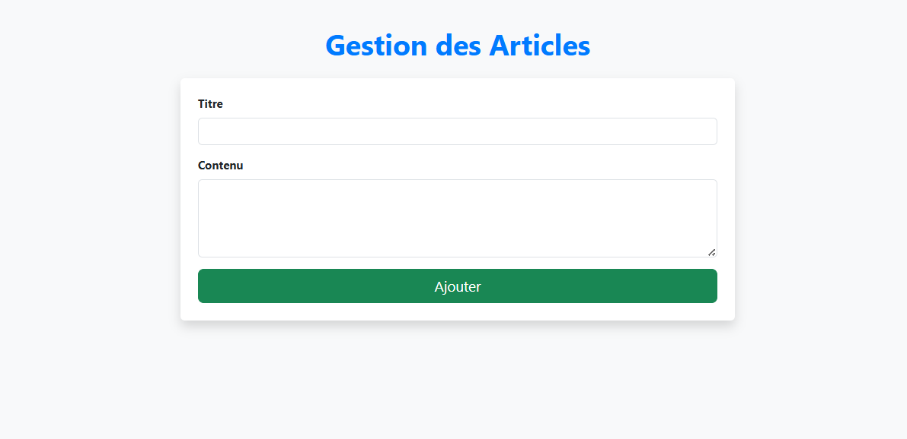

# Projet de Blog avec Microservices et Outils de Monitoring

## Architecture du Projet

Ce projet consiste en une **application de blog** construite à l'aide d'une **architecture microservices**, déployée et gérée via **Docker**. Le but est d'illustrer l'utilisation de services backend et frontend séparés, chacun fonctionnant dans son propre conteneur Docker, avec un système de surveillance pour gérer l'état des services.

### Composants Principaux

1. **Backend (API)** :
   - Développé avec **Node.js**, il gère la logique de l'application, notamment la gestion des articles.
   
2. **Frontend** :
   - Développé avec **React**, il permet aux utilisateurs de visualiser et d'ajouter des articles de blog.
   
3. **Base de Données** :
   - **MySQL** est utilisée pour stocker les articles et gérer la persistance des données.
   
4. **Outils de Monitoring** :
   - **cAdvisor** : Suivi des métriques des conteneurs.
   - **Portainer** : Interface graphique pour la gestion des conteneurs Docker.
   - **Weave Scope** : Outil de visualisation de l’infrastructure et des relations entre conteneurs.

## Schéma d'Architecture


## Fonctionnalités principales

1. **Backend (Node.js)** :
   - **GET /api/articles** : Récupérer la liste des articles du blog.
   - **POST /api/articles** : Ajouter un nouvel article à la base de données.
   - Ce service est exposé sur le port **8080** pour communiquer avec le frontend.

2. **Frontend (React)** :
   - Application React qui permet d'afficher et de créer des articles.
   - Ce service est exposé sur le port **3001**.

## Configuration Docker Compose

Le projet utilise **Docker Compose** pour faciliter le démarrage et la gestion des services via un fichier `docker-compose.yml`.

### Étapes de Développement

1. **Configuration Initiale** :
   - Création du fichier `docker-compose.yml` pour définir les services de base (Backend, Frontend, MySQL, Adminer).
   - Configuration de chaque conteneur Docker pour garantir l’interopérabilité entre les services.

2. **Ajout des Outils de Monitoring** :
   - Configuration de **cAdvisor** pour suivre les métriques des conteneurs.
   - Déploiement de **Portainer** pour gérer et visualiser l'état des conteneurs.
   - Mise en place de **Weave Scope** pour obtenir une vue d'ensemble de l'infrastructure des conteneurs et des relations entre eux.

### Configuration Réseau

Le réseau `blog-app-network` est défini dans le fichier Docker Compose pour permettre aux différents services de communiquer entre eux.

```yaml
networks:
  default:
    name: blog-app-network
```

## Outils de Monitoring Détaillés

### 1. **Portainer**
- **URL** : [http://localhost:9000](http://localhost:9000)
- **Fonctionnalités** :
  - Gestion des conteneurs Docker via une interface graphique.
  - Vue d'ensemble de l'infrastructure Docker.
  - Surveillance des ressources des conteneurs.


### 2. **cAdvisor**
- **URL** : [http://localhost:8081](http://localhost:8081)
- **Fonctionnalités** :
  - Collecte et affichage des métriques des conteneurs Docker.
  - Suivi des ressources (CPU, mémoire, réseau, etc.).
  - Interface web pour une analyse détaillée des performances des conteneurs.


### 3. **Weave Scope**
- **URL** : [http://localhost:4040](http://localhost:4040)
- **Fonctionnalités** :
  - Visualisation de l'infrastructure des conteneurs Docker.
  - Cartographie dynamique des conteneurs et des services.
  - Exploration des relations entre les différents services.


### 4. **Blog (Frontend)**
- **URL** : [http://localhost:3001](http://localhost:3001)
- Permet de visualiser et créer des articles via une interface React.



### 5. **Base de Données (MySQL)**
- **URL** : [http://localhost:8080](http://localhost:8080)
- Accès à la base de données MySQL, permettant de visualiser et interagir avec les articles stockés.


### 6. **Swagger (API Backend)**
- **URL** : [http://localhost:5000/api-docs](http://localhost:5000/api-docs)
- Documentation de l'API backend exposée via Swagger, permettant de tester les routes `GET` et `POST` pour les articles.


### 7. **Prometheus**
- **URL** : [http://localhost:9090](http://localhost:9090)
- Collecte de métriques des services.
- Interface web permettant de consulter et d'interroger les métriques collectées.
- Exposition des métriques au format Prometheus pour leur récupération par Grafana.


### 8. **Grafana**
- **URL** : [ http://localhost:3000](http://localhost:3000)
- Visualisation des métriques collectées par Prometheus.
- Création de tableaux de bord interactifs pour surveiller la santé des services.
- Accès à des métriques en temps réel pour surveiller les performances des services.


## Commandes Docker Utiles

Ces commandes permettent de gérer l'environnement Docker à partir du terminal :

```bash
# Lancer tous les services définis dans le fichier docker-compose.yml
docker-compose up -d

# Arrêter tous les services
docker-compose down

# Voir les logs d'un service spécifique
docker-compose logs <nom_du_service>
```

## Problèmes Courants et Solutions

### **Weave Scope : Erreurs de Connexion**
Si vous rencontrez des problèmes de connexion avec Weave Scope, vous pouvez essayer les solutions suivantes :
- Vérifier que **les permissions** de Docker sont correctes.
- Ajouter le flag `privileged: true` dans votre fichier `docker-compose.yml` pour accorder des privilèges accrus aux conteneurs.
- Vérifier que le module `nf_conntrack` est bien chargé dans votre système.

### **Problèmes de Connectivité Réseau entre les Conteneurs**
- Utilisez le réseau Docker **`blog-app-network`** défini dans le fichier `docker-compose.yml` pour assurer la communication entre les services.
- Ajouter des **labels Docker** à vos conteneurs pour améliorer leur gestion et visibilité via des outils comme Portainer.

## Pousser les Images Docker sur Docker Hub

Si vous souhaitez partager vos images Docker via Docker Hub, voici les étapes :

1. Connectez-vous à Docker Hub depuis le terminal :
   ```bash
   docker login
   ```

2. Taguez vos images locales avec votre nom d'utilisateur Docker Hub :
   ```bash
   docker tag votrenomdutilisateur/backend:latest votrenomdutilisateur/backend:latest
   docker tag votrenomdutilisateur/frontend:latest votrenomdutilisateur/frontend:latest
   ```


3. Poussez les images vers Docker Hub :
   ```bash
   docker push votrenomdutilisateur/backend:latest
   docker push votrenomdutilisateur/frontend:latest
   ```


Assurez-vous de remplacer "votrenomdutilisateur" par votre nom d'utilisateur Docker Hub.

## Test Healthcheck

Le test **healthcheck** est une fonctionnalité permettant de vérifier l'état de santé des conteneurs. Pour lancer le healthcheck dans un terminal PowerShell, vous pouvez utiliser la commande suivante :

```bash
bash healthcheck
```

Cela vous permettra de vérifier que tous les services fonctionnent correctement.


## Lancer les Tests avec Cypress

Les tests de l'interface utilisateur peuvent être exécutés via **Cypress**. Pour lancer les tests, exécutez la commande suivante dans le terminal :

```bash
npm run cypress:run
```

Voici un exemple de résultat de test Cypress :


---

## Installation de `act` pour Tester Localement les Workflows GitHub Actions

Si vous souhaitez tester les workflows GitHub Actions localement, vous pouvez utiliser **`act`**. Voici les étapes d'installation détaillées :

### Étapes d'installation

1. **Téléchargement de `act`** :
   Téléchargez la version Windows de `act` depuis le dépôt GitHub de [nektos/act](https://github.com/nektos/act/releases).

2. **Extraction et Installation** :
   Extrayez le fichier ZIP et placez le fichier `act.exe` dans un dossier de votre choix.

3. **Ajout de `act` au `PATH`** :
   - Ouvrez **Paramètres système avancés**.
   - Cliquez sur **Variables d'environnement**.
   - Ajoutez le chemin du dossier contenant `act.exe` (par exemple, `C:\Users\VotreNomUtilisateur\act`) à la variable **Path**.


4. **Vérification de l'installation** :
   Vérifiez que `act` est installé correctement en exécutant la commande suivante :

   ```bash
   act -v
   ```


5. **Vérification des workflows avec `act`** :
   Après l'installation, exécutez la commande suivante pour lister les workflows disponibles :

   ```bash
   act -l
   ```

---

## Problèmes rencontrés et solutions

### **Problème 1 : Erreurs liées à la version de Python**
Lors de l'exécution de `act`, des erreurs liées à la version de Python peuvent survenir. Ce problème est généralement dû à une incompatibilité entre la version de Python installée sur votre machine et l'environnement d'exécution de `act`.

#### Solution :
Vérifiez la version de Python avec la commande suivante :

```bash
python --version
```

Mettez à jour Python à la version requise

, puis réessayez l'exécution de `act`.

---

