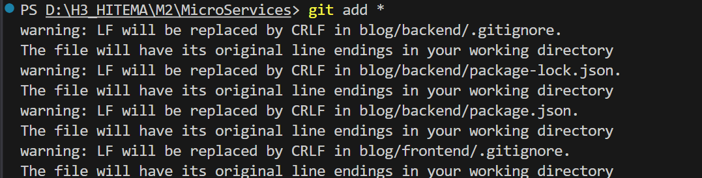
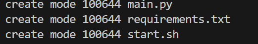
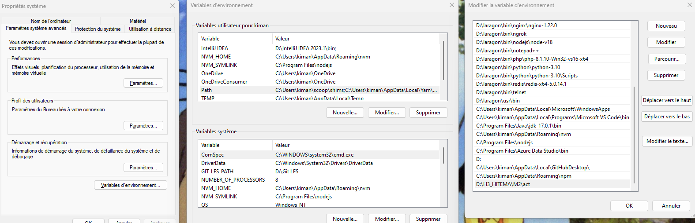
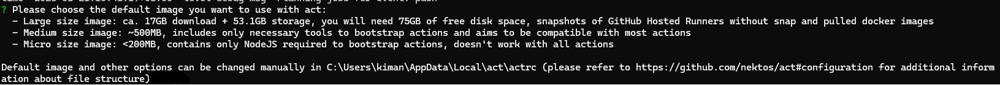
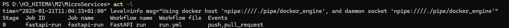

# README: Workflow GitHub Actions avec `act` et Dépannage Git et Python

## Introduction

Dans ce projet, j'ai configuré et utilisé l'outil `act` pour exécuter des workflows GitHub Actions localement. Ce README explique comment j'ai effectué les étapes de gestion de Git et de l'installation de `act`, ainsi que les problèmes que j'ai rencontrés et les solutions apportées.

---

## 1 . **Utilisation de Git pour le Workflow**

Voici les étapes que j'ai suivies pour utiliser Git dans ce projet. Toutes les étapes sont illustrées avec des images pour prouver les actions effectuées.

### Étape 1 : **Ajouter les fichiers au staging**

J'ai utilisé la commande suivante pour ajouter tous les fichiers modifiés au staging de Git :

```bash
git add *
```

Voici le résultat de l'exécution de cette commande :



### Étape 2 : **Committer les changements**

Après avoir ajouté les fichiers, j'ai commis les changements avec un message explicite :

```bash
git commit -m "Votre message de commit"
```

Voici une capture d'écran montrant le commit effectué :



### Étape 3 : **Pousser les changements vers le dépôt distant**

Ensuite, j'ai poussé mes changements vers le dépôt distant avec la commande suivante :

```bash
git push
```

Voici ce que j'ai vu après avoir poussé les changements :


### Étape 4 : **Créer une Pull Request**

Une fois mes changements poussés, j'ai créé une Pull Request sur GitHub pour proposer mes modifications. Voici l'interface de la PR sur GitHub :


### Étape 4 : **Créer une Pull Request**

Après avoir effectué mes changements, je me suis assuré que mes workflows fonctionnaient correctement dans la partie Action sur GitHub :


---

## 2 . **Installation de `act`**

### Étapes d'installation

1. **Téléchargement de `act`**
   
   J'ai téléchargé la version Windows de `act` depuis le dépôt GitHub de [nektos/act](https://github.com/nektos/act/releases).
   
2. **Extraction et installation**
   
   J'ai extrait le fichier ZIP et placé le fichier `act.exe` dans un dossier de mon choix sur mon ordinateur.

3. **Ajout de `act` au PATH**

   Pour rendre `act` accessible depuis le terminal, j'ai ajouté son dossier au `PATH` système :
   
   - Ouvrez les **Paramètres système avancés**.
   - Cliquez sur **Variables d'environnement**.
   - Dans la section **Variables système**, sélectionnez la variable `Path` et cliquez sur **Modifier**.
   - Ajoutez le chemin du dossier contenant `act.exe` (par exemple, `C:\Users\VotreNomUtilisateur\act`).
   - Cliquez sur **OK** pour valider.

   Voici à quoi cela ressemble dans les paramètres système :

   

4. **Vérification de l'installation**

   J'ai vérifié l'installation de `act` en tapant la commande suivante dans le terminal :

   ```bash
   act -v
   ```

   Lors de la première exécution, `act` m'a demandé de choisir une image Docker à utiliser pour exécuter les workflows. J'ai eu le choix entre plusieurs options d'images de différentes tailles :

   - **Image de grande taille** : Environ 17 Go, nécessite 75 Go d'espace disque libre.
   - **Image de taille moyenne** : Environ 500 Mo, compatible avec la plupart des actions.
   - **Image de taille micro** : Moins de 200 Mo, contient uniquement NodeJS pour démarrer les actions.

   J'ai choisi l'image de **taille micro** pour sa légèreté.

   

5. **Vérification des workflows avec `act`**

   Après avoir configuré `act`, j'ai exécuté la commande `act -l` pour lister les workflows disponibles.

   Voici le résultat obtenu :

   

---

## 3. **Problèmes rencontrés et solutions**

### Problème 1 : **Erreurs liées à la version de Python**

Lors de l'exécution de `act`, j'ai rencontré des erreurs qui étaient liées à la version de Python installée sur mon système. Cela est souvent dû à une incompatibilité entre les versions de Python et l'environnement d'exécution des actions.

#### Solution :

J'ai vérifié ma version de Python en utilisant la commande :

```bash
python --version
```

Ensuite, j'ai mis à jour Python à la version appropriée.

### Problème 2 : **Problème avec `git checkout`**

Lors de l'utilisation de `git checkout`, j'ai eu quelques erreurs de branchement, généralement liées à des fichiers non suivis ou à des conflits dans le dépôt.

#### Solution :

Avant d'effectuer un `git checkout`, j'ai vérifié l'état du dépôt avec la commande :

```bash
git status
```

Cela m'a permis de m'assurer que tous mes fichiers étaient correctement ajoutés ou ignorés avant de basculer de branche.

---

