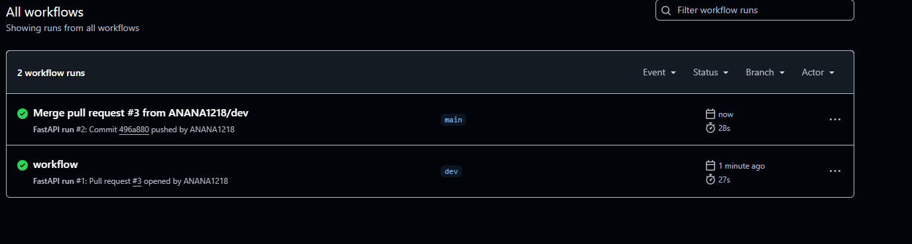
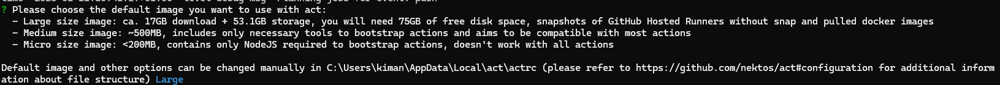

 le git checkout

 

 git add *

 

 git commit 

 

 git push 

 

 pull request 

 

 

 

 resultat de mon workflows

 

installation de act 

- Téléchargez la version Windows de act depuis le dépôt GitHub de nektos/act. https://github.com/nektos/act/releases
- Extrayez le fichier ZIP et placez le fichier act.exe dans un dossier de votre choix.

- Ajoutez act au PATH
Pour rendre act utilisable dans le terminal, ajoutez son dossier au PATH de votre système :
Ouvrez les Paramètres système avancés.
Cliquez sur Variables d'environnement.
Dans la section Variables système, sélectionnez la variable Path et cliquez sur Modifier.
Ajoutez un nouveau chemin pointant vers le dossier contenant act.exe (par exemple, C:\Users\VotreNomUtilisateur\act).
Cliquez sur OK pour valider.

Lorsque vous exécutez act -v pour la première fois, act vous demande de choisir une image Docker par défaut à utiliser pour exécuter vos workflows GitHub Actions localement.

 les options :

 Image de grande taille : environ 17 Go à télécharger + 53,1 Go de stockage, nécessitant 75 Go d'espace disque libre. Cette image contient des instantanés des GitHub Hosted Runners sans snap et les images Docker pré-téléchargées.
Image de taille moyenne : environ 500 Mo, incluant uniquement les outils nécessaires pour démarrer les actions. Elle vise à être compatible avec la plupart des actions.
Image de taille micro : moins de 200 Mo, contenant uniquement NodeJS requis pour démarrer les actions. Cette option ne fonctionne pas avec toutes les actions.

Vous pouvez sélectionner l'option souhaitée en utilisant les flèches du clavier. L'image par défaut et d'autres options peuvent être modifiées manuellement dans le fichier de configuration. 

j'ai choisi le micro : 
